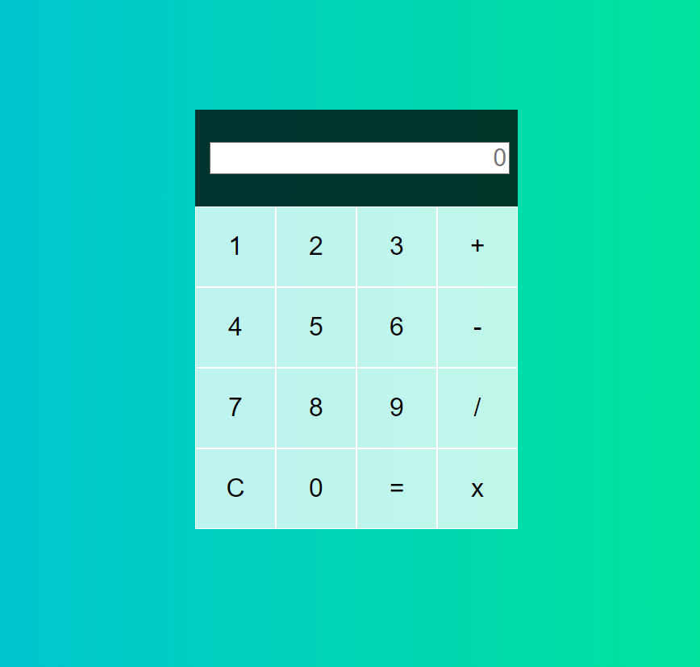

# Calculadora Básica




Este es un proyecto de calculadora básica hecho con **HTML**, **CSS** y **JavaScript**. La calculadora permite realizar operaciones aritméticas simples como suma, resta, multiplicación y división, además de contar con una función de "borrar" para restablecer la operación.

## Tabla de Contenidos
1. [Descripción del Proyecto](#descripción-del-proyecto)
2. [Características](#características)
3. [Estructura de Archivos](#estructura-de-archivos)
4. [Detalles Técnicos](#detalles-técnicos)
5. [Estilos CSS](#estilos-css)
6. [Uso](#uso)
7. [Demo](#demo)

## Descripción del Proyecto

Este proyecto es una calculadora de operaciones básicas, diseñada para ser simple y fácil de usar. La interfaz está desarrollada con HTML y CSS, mientras que JavaScript se utiliza para la lógica de las operaciones.

## Características

- **Operaciones Aritméticas**: Suma, resta, multiplicación y división.
- **Pantalla**: Muestra el resultado actual y el cálculo en proceso.
- **Función de Borrado**: Permite limpiar la pantalla y restablecer la operación.
- **Interfaz amigable**: El diseño utiliza una cuadrícula para una disposición ordenada y clara.

## Estructura de Archivos

El proyecto está compuesto por los siguientes archivos:

- `index.html`: Contiene la estructura HTML.
- `style.css`: Archivo de estilos CSS para la interfaz.
- `calc.js`: Archivo JavaScript con la lógica de la calculadora.

## Detalles Técnicos

### HTML

La estructura HTML incluye una cuadrícula de botones (diseñada con CSS Grid) para los números, operadores y un botón de "borrar".

```html
<div class="calculadora-grilla">
    <div class="output">
        <input class="display" type="text" id="result" placeholder="0">
    </div>
    <button name="data-numer">1</button>
    <button name="data-numer">2</button>
    <!-- ... otros botones ... -->
    <button name="data-opera">x</button>
</div>  
```

## CSS
El archivo CSS (`style.css`) define el estilo de la calculadora con un fondo degradado, estilo para los botones y el área de pantalla.

## JavaScript
La lógica de la calculadora está implementada en `calc.js`, donde se manejan las operaciones aritméticas y las actualizaciones de pantalla.

### Eventos
Los botones utilizan `addEventListener` para detectar clics y ejecutar funciones asociadas como `agregarNumero`, `selectOperaction`, `calcular`, y `clear`.

### Funciones principales
- **agregarNumero(num)**: Agrega un número al valor actual.
- **selectOperaction(op)**: Selecciona la operación matemática (+, -, x, /).
- **calcular()**: Realiza el cálculo y actualiza el resultado.
- **clear()**: Limpia los valores actuales y reinicia la operación.

## Estilos CSS
Los estilos principales incluyen:

- **Cuadrícula**: Disposición de botones en una cuadrícula de 4 columnas con un tamaño uniforme.
- **Display**: Área de visualización con fondo oscuro y texto alineado a la derecha.
- **Botones**: Estilo blanco translúcido, resaltado al pasar el cursor.

### Ejemplo de código CSS:
```css
.calculadora-grilla {
    display: grid;
    grid-template-columns: repeat(4, 100px);
    grid-template-rows: minmax(120px, auto) repeat(5, 100px);
    /* otros estilos */
}
```
## Uso
Para utilizar la calculadora:

1. Selecciona los números y el operador.
2. Haz clic en `=` para ver el resultado.
3. Usa el botón `C` para borrar el resultado y empezar una nueva operación.


